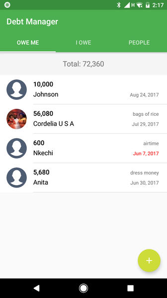
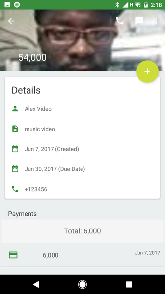
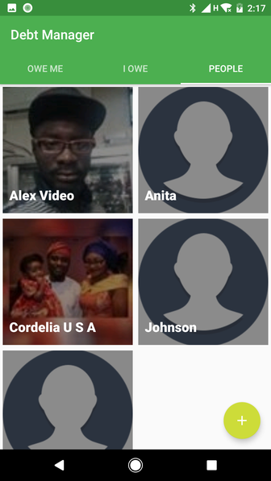
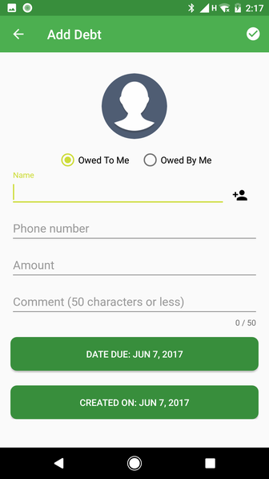

# Debt-Manager
A personal app to store people that owe you money or you owe money to. :notebook: :moneybag:

"Mo Money Mo Problems" - The Notorious B.I.G. :sunglasses:

You can download it from Google Play Store https://play.google.com/store/apps/details?id=com.chikeandroid.debtmanager

 

 

### Contents:

##### libraries:
* Dagger 2 
* Glide
* Stetho
* Android Databinding 
* EventBus 
* Fabric (Crashlytics)

##### Static analysis:
* PMD (https://pmd.github.io/ - check file quality.gradle)
* Checkstyle
* Lint
* Findbugs

##### Testing:
* Espresso tests
* Junit tests
* Idling resources

##### View Related:
* Added constraint layout! (See list_item_payment.xml)

### Roadmap
 * App shortcuts
 * Add currencies 
 * Password or fingerprint protection 
 * Add reminder 
 * Share debt detail
 * Search debtor
 * Remote backup 

## How can I thank you?

Why not star the github repo? I'd love the attention! Why not share the link for this repository on Twitter or HackerNews? Spread the word!

Don't forget to [follow me on twitter](https://twitter.com/chk01010)!

Thanks!

Chike Mgbemena.

You can catch me at www.chikemgbemena.com

Any feedback/pull request is welcome!

## License

The MIT License (MIT). Please see [License File](LICENSE) for more information.
